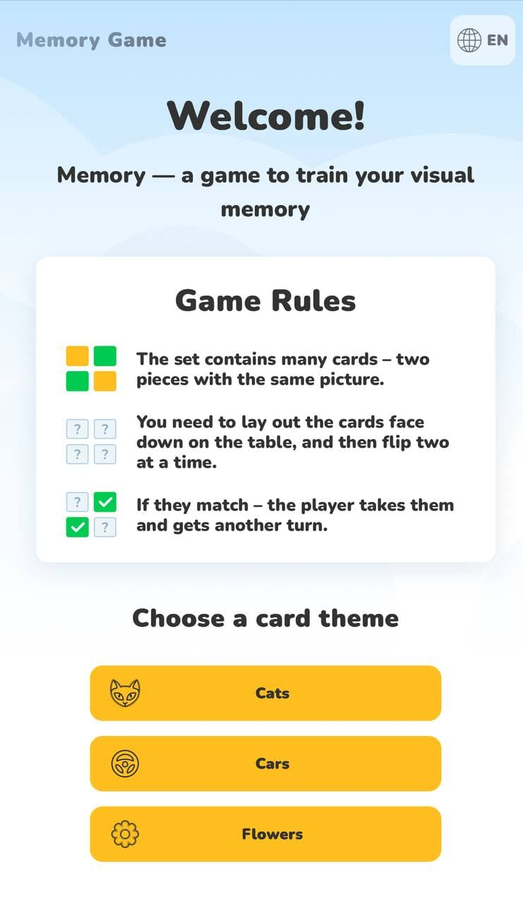
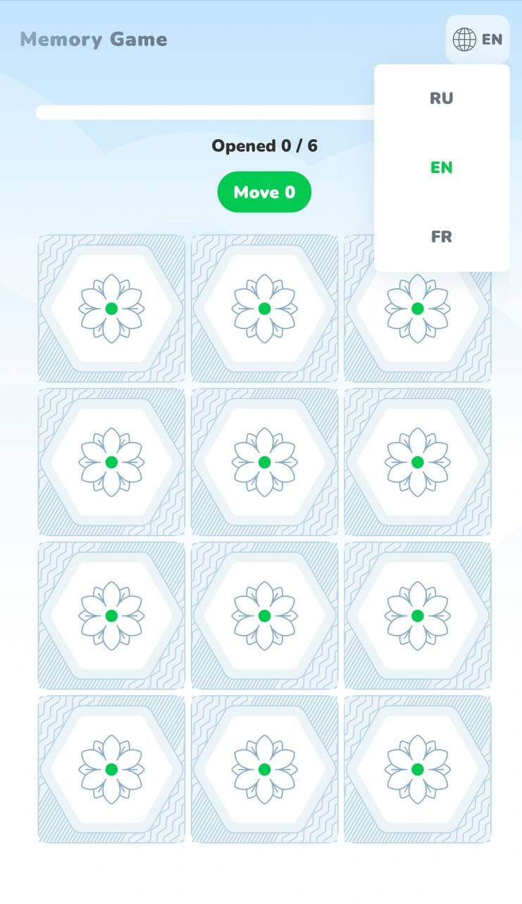

# 🎮 Memory Game

> Modern React memory training app with production-grade architecture and exceptional performance

[](https://olgagulyakevich.github.io/memory-game/)
[](https://reactjs.org/)
[](https://github.com/OlgaGulyakevich/memory-game)
[](https://github.com/OlgaGulyakevich/memory-game)

<div align="center">
  


**[🎮 Play Game](https://olgagulyakevich.github.io/memory-game/)** • **[📖 Documentation](https://github.com/OlgaGulyakevich/memory-game#-features-deep-dive)** • **[🐛 Report Bug](https://github.com/OlgaGulyakevich/memory-game/issues)**

</div>

---

<div align="center">
  


### 🎬 Gameplay Demo

<video src="file:///Users/olgagulakevic/Desktop/html-academy/memory-game/public/img/screenshots/gameplay-screenshot.mp4" width="800" controls></video>

*Note: If video doesn't play, [view it here](public/img/screenshots/gameplay-demo.mp4)*

### 📱 Mobile Responsive Design

<table>
<tr>
<td width="50%">
  
  <p align="center"><em>Portrait Mode</em></p>
</td>
<td width="50%">
  
  <p align="center"><em>Landscape Mode</em></p>
</td>
</tr>
</table>

</div>

---

## ✨ Highlights

<table>
<tr>
<td width="50%">

### 🎯 User Experience
- **3 Themed Card Sets** with custom artwork
- **Multilingual** (EN/RU/FR) with i18next
- **Smooth 3D Animations** (60fps+)
- **Fully Responsive** — mobile-first design
- **Keyboard Navigation** — WCAG AA compliant

</td>
<td width="50%">

### ⚡ Technical Excellence
- **React 19** with modern hooks architecture
- **Lighthouse 98/100** performance score
- **115KB gzipped** total bundle size
- **Zero runtime errors** in production
- **Comprehensive testing** documentation

</td>
</tr>
</table>

---

## 🎬 Quick Start

```bash
# Clone repository
git clone https://github.com/olgagulyakevich/memory-game.git

# Install dependencies
npm install

# Start development server
npm start  # Opens at http://localhost:3001

# Build for production
npm run build
```

---

## 🎮 Features Deep Dive

<details>
<summary><b>🎨 Three Beautiful Themes</b></summary>

- **Cats Theme** — Adorable feline companions
- **Cars Theme** — Classic automotive collection  
- **Flowers Theme** — Botanical garden variety

Each theme features hand-picked imagery optimized for performance.

</details>

<details>
<summary><b>🌍 Full Internationalization</b></summary>

- **3 Languages**: English, Russian, French
- **react-i18next** integration
- **Persistent language preference**
- **Fallback to English** for missing translations

</details>

<details>
<summary><b>♿ Accessibility First</b></summary>

- **WCAG AA Compliant** — proper contrast ratios
- **Keyboard Navigation** — fully playable without mouse
- **Screen Reader Support** — comprehensive ARIA labels
- **Semantic HTML** — proper document structure

</details>

<details>
<summary><b>⚡ Performance Optimized</b></summary>

- **React.memo** — component memoization
- **Hardware Acceleration** — CSS 3D transforms
- **Code Splitting** — optimized bundle chunks
- **Image Optimization** — WebP with fallbacks

**Lighthouse Scores:**
- Desktop: 98/100 Performance
- Mobile: 95+/100 Performance
- 100/100 Accessibility, Best Practices, SEO

</details>

---

## 📊 Performance Metrics

| Metric | Desktop | Mobile | Target |
|--------|---------|--------|--------|
| **Performance** | 98/100 | 95/100 | >90 ✅ |
| **FCP** | 0.4s | 1.0s | <1.8s ✅ |
| **LCP** | 0.6s | 2.3s | <2.5s ✅ |
| **Bundle Size** | 115KB gzipped | — | <250KB ✅ |

<details>
<summary>📦 Bundle Composition (click to expand)</summary>

```
react-vendor.js        51.39 KB  (44.5%)
main.js                29.42 KB  (25.5%)
vendors.js             16.64 KB  (14.4%)
router-vendor.js       11.53 KB  (10.0%)
react-vendor-2.js       5.30 KB   (4.6%)
runtime.js              0.96 KB   (0.8%)
```

*Total gzipped: 115.44 KB*

</details>

---

## 🏗️ Architecture

Built with modern React patterns and professional development practices:

```
src/
├── components/          # React components
│   ├── pages/          # Route-level components
│   └── ui/             # Reusable UI components
├── hooks/              # Custom React hooks (useGame)
├── utils/              # Helper functions & config
├── locales/            # i18n translation files
└── styles/             # Global CSS with design tokens
```

**Key Technologies:**
- React 19 with hooks
- React Router 7 for SPA routing
- react-i18next for internationalization
- Webpack 5 with optimizations
- CSS3 with custom properties

<details>
<summary><b>💡 Code Quality Example — Custom Hook Architecture</b></summary>

```javascript
// Custom hook with optimized game logic
const useGame = (images) => {
  const [finishedItems, setFinishedItems] = useState([]);
  const [stepsCount, setStepsCount] = useState(0);
  const [errors, setErrors] = useState(0);

  const checkItems = (firstItem, secondItem) => {
    const firstImage = images.find(({id}) => id === firstItem);
    const secondImage = images.find(({id}) => id === secondItem);
    
    if (firstImage.url === secondImage.url) {
      setFinishedItems((items) => [...items, firstItem, secondItem]);
    } else {
      setErrors((e) => e + 1);
    }
    setStepsCount((i) => i + 1);
  };

  const isWin = finishedItems.length > 0 && 
                finishedItems.length === images.length;

  return { finishedItems, stepsCount, errors, checkItems, isWin };
};
```

**Why this approach?**
- Clean separation of business logic from UI
- Immutable state updates for predictable behavior
- Easy to test and maintain
- Follows React best practices

</details>

---

## 🧪 Quality Assurance

This project includes comprehensive testing documentation:

- ✅ **[Manual Testing Checklist](public/docs/testing/manual-testing-checklist.md)** — Cross-browser compatibility
- ♿ **[Accessibility Audit](public/docs/testing/accessibility-checklist.md)** — WCAG AA compliance
- ⚡ **[Performance Benchmarks](public/docs/testing/performance-benchmarks.md)** — Core Web Vitals

---

## 🚀 Deployment

Deployed on **GitHub Pages** with automatic CI/CD:

```bash
npm run deploy  # Builds and deploys to gh-pages branch
```

**Production Features:**
- SPA routing with 404 fallback
- Asset optimization and caching
- SEO-friendly meta tags
- Social media preview cards

---

## 📝 License

MIT License — feel free to use this code for learning and inspiration.

---

## 💼 Portfolio Highlight

This project demonstrates:
- ✅ Modern React development practices
- ✅ Performance-focused architecture  
- ✅ Accessibility compliance (WCAG AA)
- ✅ Production-ready deployment pipeline
- ✅ Comprehensive documentation

**Perfect for:** Frontend Developer / React Developer / Senior Frontend Engineer positions

---

<div align="center">

**Built with ❤️ using React 19 and modern web standards**

[🎮 Play Now](https://olgagulyakevich.github.io/memory-game/) • [💼 LinkedIn](https://linkedin.com/in/olga-gulyakevich) • [📧 Contact](mailto:olga.gulyakevi4@gmail.com) • [🛠️ Tech Stack Details](public/docs/TECH_STACK.md)

</div>